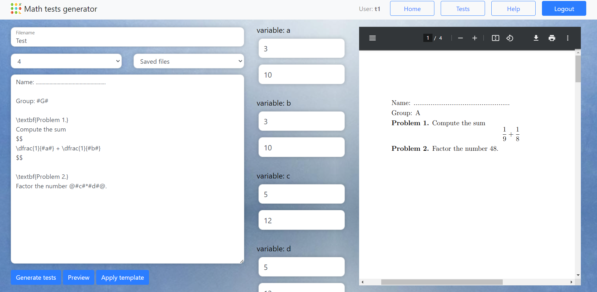

# Math Tests Generator
Final Project for CS50 2023 course



## Video Demo:

## Deployment
[https://mathtestsgenerator.piotrw777.com](https://mathtestsgenerator.piotrw777.com)


## Project overview
The Math Tests Generator is a web application built using the Flask framework, designed to facilitate the creation of multiple versions of math tests from a single LaTeX template. It empowers educators and instructors to efficiently produce custom math tests with varying values for defined variables. The application encompasses a range of features aimed at enhancing user experience and productivity.

The Math Tests Generator primarily targets educators, teachers, and instructors who require customized math tests for their students. It is designed to simplify the test generation process and enhance productivity.

## Features
+ Create PDF documents containing multiple versions of tests, each with different values for predefined variables.
+ Manage user accounts with email verification and password recovery functionalities.
+ Save and access previously created tests.
+ Create new tests based on existing LaTeX templates.
+ Access to generated LaTeX code for each test.
+ Experience real-time previews of generated documents.

## Used languages & technologies
+ Flask framework for handling backend side
+ HTML, CSS, Javascipt for frontend
+ Bootstrap library which makes web-app modern looking
+ Flask SQLAlchemy for secure database operations
+ pylatex library for compiling LaTeX code on the server side
+ itsdangerous python library for serialising data during password recovery

## Design
In the Math Tests Generator web application, I applied a user-centric design approach to ensure a smooth and user-friendly experience. One key design element is the process of submitting forms, which involves a sequence of steps:

### Data Validation with JavaScript
+ When a user submits a form, the application first executes a JavaScript function to validate the data entered in the form fields.
+ JavaScript performs client-side validation, checking for errors such as missing fields, invalid formats, or out-of-range values.
+ If any errors are detected during this client-side validation, the JavaScript function immediately informs the user about these errors without redirecting them.

### Real-Time Error Feedback
+ Instead of redirecting the user to a new page or displaying generic error messages, the 
web application provides real-time error feedback directly on the current page.
+ Error messages are displayed next to the relevant form fields, clearly indicating what needs to be corrected.
+ This approach enhances the user experience by allowing users to fix errors without losing their entered data or navigating away from the form.

### POST Request to Server
+ After the client-side validation process, if all data is valid according to the predefined rules, a POST request is sent to the server.
+ The POST request contains the user's input data, which is then processed on the server-side.
+ To enhance security, each page contains unique CSRF token generated for each user session.
On the server side the token is checked whether the request comes from a valid page. It protects from processing POST requests from faked pages.

### Server-Side Processing
+ On the server side (implemented in app.py), the application further validates and processes the data received from the client.
+ Server-side validation ensures data integrity and security, protecting against any potential malicious input.
+ Depending on the result of this server-side processing, the application takes appropriate actions. For example:
+ If the data is valid and the request is successful, the application may generate a PDF document with the requested math test variations.
+ If there are any server-side errors, the application can provide specific error messages or instructions to the user.

### Benefits of this Design Approach
+ Enhanced User Experience: By providing real-time error feedback, users can quickly identify and correct errors without the frustration of page reloads or redirects.
+ Data Integrity: Combining client-side and server-side validation ensures that only valid data is processed, enhancing the integrity and security of the application.
+ Efficient Workflow: Users can seamlessly submit data, confident that the application will guide them through the process with clear feedback.
+ Error Handling: The application is capable of handling errors gracefully, providing users with helpful information when issues arise.

## Files description
### app.py
    It serves as the core backend file for the Math Tests Generator web application. It is responsible for handling various routes and requests from the frontend, ensuring the proper functionality of the application. Key features and responsibilities of this file include

    1. Route Handling: "app.py" defines routes to manage user interactions, such as creating new tests, saving test data, user account management.

    2. User Authentication: It contains code for user authentication and authorization, including user account creation, email verification, and password recovery option.

    3. Database Operations: This file interfaces with the database using Flask SQLAlchemy to manage user data, test templates, and other relevant information.

    4. LaTeX Compilation: It uses the "pylatex" library to compile LaTeX code on the server side, enabling the generation of PDF documents from math test templates.

    5. Security Measures: "app.py" implements security measures, including data validation, verification of tokes to protect against potential vulnerabilities.

### config.py helpers.py
    Those files contains helper functions used in app.py file

### static/background-image.jpg
    Background image of the page

### static/bootstrap.bundle.min.js static/bootstrap.bundle.min.js.map static/bootstrap.min.css
    CSS files nedded by Bootstrap library used for example for proper Navbar display.

### static/floating-labels.css
    CSS file needed for proper display of Bootstrap's floating labels

#### static/brand.png static/favicon.ico
    Icon of the project

### static/script.js
    This is a crucial component of the Math Tests Generator web application, responsible for enhancing the frontend's interactivity and user experience.
    Key responsibilities and features of "script.js" include:

    Form Validation: 

    Real-Time Error Handling

    Communication with Backend by fetch POST requests

    Adjusting web page dynamically by creating forms for each variable defined by the user

### static/styles.css
    Main stylesheet of the page

### templates/layout.html
    Main Jinja template including navbar and head 

### templates/index.html
    Main page for generating tests

### templates/login.html
    Logging screen

### templates/register.html
    Page for new users to register

### templates/verify.html
    Page to verify new user
### templates/forgot-password.html
    Page for password recovery request
### templates/change-password.html
    Page for providing new password
### templates/help-modal.hrml
    Page containing instruction for the user how to use the web application
### templates/tests.html
    Page containing columnt with all the tests saved by the user
    with options to manage the files
### templates/apology.html
    Error page displayed when use tries to use password recovery link that has expired
### README.md
    The file you read right now :)
### setup_server.sh
    Bash script for installing all necessary packages for server to run
### start_server.sh
    Bash script for starting the local server
### example.png
    Screen of web app shown in README.md file


### Setup local server (Ubuntu 18.04, Ubuntu 20.04, Ubuntu 22.04)
```
./setup_server.sh
```
This will install all necessary packages needed for server to run.

### Run local Flask server:
*NOTE: Because the application is sending confirmation emails to the user, credentials read from env values in config.py file are necessary for the application to run properly.*

Firstly, create database by running:
```
python3
from app import app
from app import db
db.create_all()
```
Then execute those commands:
```
source ./myenv/bin/activate
flask run
```
Or use the script that will do this automatically:
```
./start_server.txt
```


## Bibliography

https://www.w3schools.com/js

https://bobbyhadz.com/blog/javascript-get-difference-between-two-sets

https://www.codespeedy.com/how-to-pass-javascript-variables-to-python-in-flask/

https://rahulbaran.hashnode.dev/how-to-send-json-from-javascript-to-flask-using-fetch-api

https://jeltef.github.io/PyLaTeX/current/

CS50 Web development course
https://www.youtube.com/watch?v=zFZrkCIc2Oc&t=6199s

Flask context
https://www.youtube.com/watch?v=JsZ1C9O_2XE

Python evaluation
https://pypi.org/project/py-expression-eval/

Boostrap Modals
https://github.com/Ara225/mini-frontend-projects/blob/master/2-bootstrap-modal-without-jQuery/bootstrap-modal-without-jQuery.html

Speed up loading background image
https://wpspeedmatters.com/speed-up-background-images/

itsdangerous library
https://itsdangerous.palletsprojects.com/en/2.1.x/
